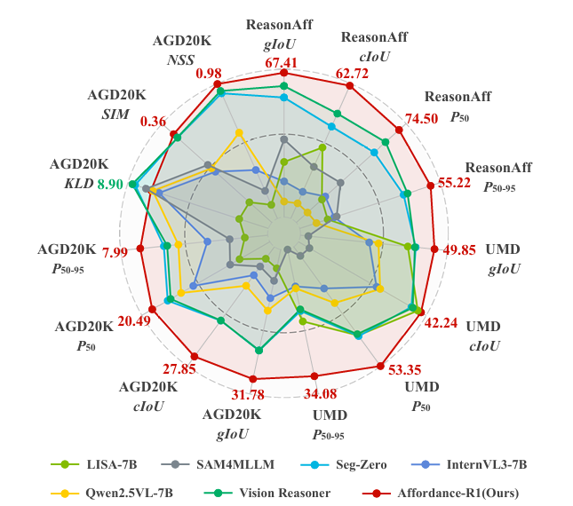
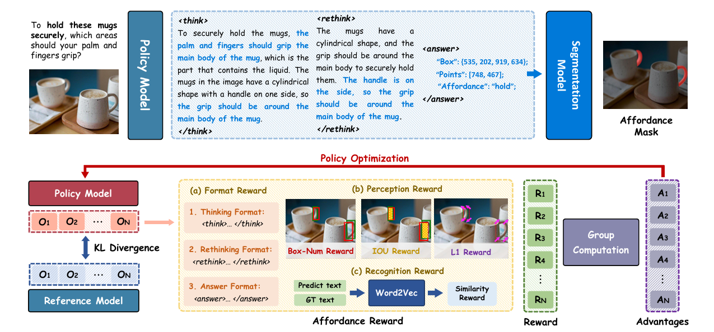
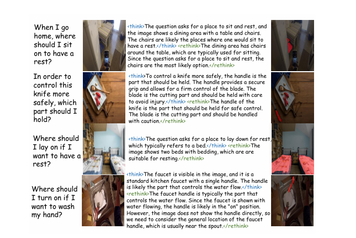

<div align="center">
<h1 align="center" >
 Affordance-R1: Reinforcement Learning for Generalizable Affordance Reasoning in Multimodal Large Language Model
</h1>


The repo is the official implementation of **"Affordance-R1: Reinforcement Learning for Generalizable Affordance Reasoning in Multimodal Large Language Model"**.   

Paper: [📖 Arxiv](https://arxiv.org/abs/2508.06206)   
Model: [🤗 Affordance-R1](https://huggingface.co/hqking/affordance-r1)
</div>


## News

[Aug 11th, 2025] 🔥 Affordance-R1 is coming! We have released the code !!!


Performance of Affordance-R1:
<div align=center>

</div>

> Affordance-R1 demonstrates extraordinary affordance reasoning ability and powerful generalization ability.

## Model
<div align=center>

</div>

> Affordance-R1 framework overview. The model processes queries through policy-based reasoning with < think > and < rethink > stages to generate affordance predictions. The policy optimization uses a sophisticated reward system
 comprising (a) format rewards for reasoning structure, (b) perception rewards for spatial accuracy (Box-Num, IOU, L1), and (c) recognition rewards for semantic similarity, enabling effective GRPO-based training for affordance reasoning

## Visualization on Web Image

<div align=center>

</div>

Affordance-R1 can  understand complex scenarios and shows good generalization.


## Installation
```bash
git clone https://github.com/hq-King/Affordance-R1.git
cd Affordance-R1
conda create -n Affordance-R1 python=3.12
conda activate Affordance-R1
pip install torch==2.6.0 torchvision==0.21.0
pip install -e .
pip install gensim
```

## Inference
Download pretrained models: [🤗 Affordance-R1](https://huggingface.co/hqking/affordance-r1)
Modify the path in inference_scripts/infer.py and then run the following 
```bash
python inference_scripts/infer.py 
```

## Training
Download pretrained models:[Qwen2.5-VL-7B](https://huggingface.co/Qwen/Qwen2.5-VL-7B-Instruct) and [SAM2](https://huggingface.co/facebook/sam2-hiera-large)
Modify the path in `training_scripts/aff_r1.sh` and  `training_scripts/aff_r1.yaml`  and then run the following command to start training:
```bash
bash training_scripts/run_aff_r1.sh
```
After training, run the following command to merge the model"
```bash
python3 training_scripts/model_merger.py --local_dir [path_to_your_actor_checkpoint]```
```

## Evaluation  
Data will be released soon! Stay tuned!
```bash
bash evaluation_scripts/eval_aff_r1.sh
```


## Acknowledgement
We would like to thank the following repos for their great work: 

- This work is built upon the [seg_zero](https://github.com/dvlab-research/Seg-Zero) and [veRL](https://github.com/volcengine/verl).
- This work utilizes models from  [Qwen2-VL](https://huggingface.co/Qwen/Qwen2-VL-2B-Instruct), [Qwen2.5-VL](https://huggingface.co/Qwen/Qwen2.5-VL-7B-Instruct) and [SAM2](https://huggingface.co/facebook/sam2-hiera-large). 


